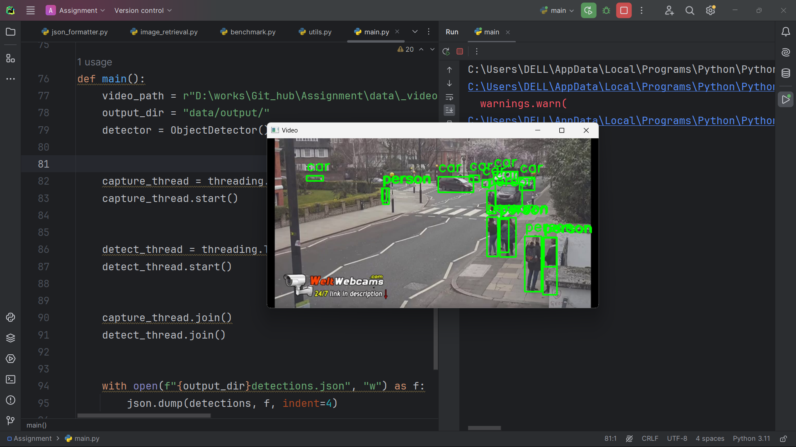

# Object and Sub-Object Detection System(TrackNet)

## Overview

This project focuses on creating a robust computer vision system that is capable of detecting objects and their associated sub-objects in a hierarchical structure. The system not only detects objects but also maps sub-objects to their parent objects, providing a comprehensive detection pipeline. Additionally, it allows users to retrieve and save cropped images of detected sub-objects and optimizes performance to run in real-time on a CPU.

The project uses a multi-threaded approach to simultaneously process video frames and detect objects, ensuring a smooth experience for real-time video processing. This system leverages AI tools and deep learning frameworks to provide accurate detections.

## Features

- **Object and Sub-Object Detection**: Detects common objects like "person," "car," "bicycle," etc., along with their sub-objects (e.g., helmet for person, tire for car).
- **JSON Output**: The system outputs hierarchical JSON containing detected objects and their sub-objects with bounding boxes.
- **Sub-Object Image Retrieval**: Allows users to crop and save sub-object images for further analysis.
- **Real-time Processing**: The system is optimized to run at 10-30 frames per second on a CPU.
- **Multi-threading**: Implements multi-threading for video processing and detection to improve performance.
- **Modular Design**: The system is modular and can be easily extended to include new object-sub-object relationships.

## Requirements

Before running this project, make sure you have the following installed:

- Python 3.7+
- PyTorch (with the proper version for CPU usage)
- OpenCV
- torchvision
- Other dependencies listed in `requirements.txt`

To install the required libraries, run:

```bash
pip install -r requirements.txt
```

## File Structure

The project is organized as follows:

```
/ProjectFolder
│
├── data/
│   └── _video.mp4            # Sample video for testing
│   └── output/               # Output directory for storing images and results
├── detection.py              # Object detection using pre-trained Faster R-CNN model
├── json_formatter.py         # Formatting the detections into JSON format
├── image_retrieval.py        # Cropping and saving sub-object images
├── benchmark.py              # Benchmarking the FPS for video processing
├── utils.py                  # Utility functions for mapping sub-objects
├── main.py                   # Main script to run the object detection
├── requirements.txt          # List of required Python packages
└── README.md                 # Project documentation
```

## How to Run the Project

1. **Clone the repository:**

```bash
git clone <repository_url>
```

2. **Install the required dependencies:**

```bash
pip install -r requirements.txt
```

3. **Place a sample video in the `data/` directory** (or use the provided `data/_video.mp4`).

4. **Run the `main.py` script** to start object detection and video processing:

```bash
python main.py
```

5. The output will include:
   - JSON results of the detections, saved in the `data/output/detections.json` file.
   - Cropped sub-object images saved in the `data/output/` folder.
   - Real-time performance statistics for the video processing.

## AI Tools Used

- **PyTorch**: A deep learning framework for building and training the Faster R-CNN model for object detection.
- **OpenCV**: Used for video processing, frame extraction, and image manipulation.
- **TorchVision**: Provides the pre-trained Faster R-CNN model for object detection.
- **Multi-threading**: Python's threading module to process video and detection in parallel for improved performance.

## Project Inspiration and References

This project is inspired by various real-world computer vision tasks, including object detection, sub-object tracking, and video processing.

- [Faster R-CNN: Towards Real-Time Object Detection with Region Proposal Networks](https://arxiv.org/abs/1506.01497)
- [PyTorch Object Detection Tutorial](https://pytorch.org/tutorials/intermediate/torchvision_tutorial.html)
- [OpenCV Documentation](https://docs.opencv.org/)
- [object-detection-resnet](https://github.com/srbhr/Object-Detection.git)
- [computer-vision-resnet-object-detector](https://github.com/Russolves/Computer-Vision-ResNet-Object-Detector.git)

## About the Developer

TrackNet was developed by **Ayush Soni**, a student pursuing an MCA (Hons) in AI and ML at Lovely Professional University. It was created as part of an assignment to demonstrate object detection and video processing capabilities using deep learning and AI techniques.

## Output

Below is an example of output:


